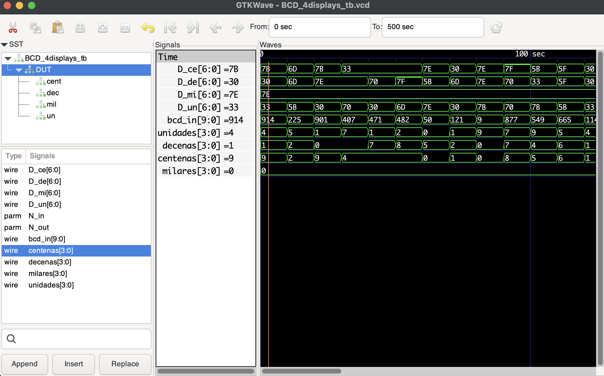

# PRAC_2: 10-Bit Binary to Decimal Display

## Objective
The goal of this assignment is to design a digital system that converts a **10-bit binary number** (entered via switches) into its corresponding **decimal format**, displayed on four 7-segment displays.

## I/O Pin Mapping
This project is designed for the **DE10-Lite** (or similar) board.

| Signal | Type | Hardware Component | Description |
| :--- | :--- | :--- | :--- |
| **Input** | `[9:0]` | **Switches (SW9 - SW0)** | Represents the 10-bit binary number (0 to 1023). |
| **Output** | `7-bit` | **HEX0** | Displays the **Units** digit. |
| **Output** | `7-bit` | **HEX1** | Displays the **Tens** digit. |
| **Output** | `7-bit` | **HEX2** | Displays the **Hundreds** digit. |
| **Output** | `7-bit` | **HEX3** | Displays the **Thousands** digit. |

## Included Files

* **`BCD_4displays_W.v` (Wrapper):** The top-level module for the FPGA. It connects the logic to the physical board pins (`SW` inputs and `HEX` outputs).
* **`BCD_4displays.v` (Main Logic):** Handles the mathematics. It separates the 10-bit input into units, tens, hundreds, and thousands using modular arithmetic (`% 10`, `/ 10`, etc.).
* **`BCD.v` (Decoder):** A standard BCD-to-7-segment decoder. It converts a 4-bit digit (0-9) into the 7-bit code required to light up the display segments (Active Low logic).
* **`BCD_4displays_tb.v`:** The testbench file used for simulation. It generates random inputs (0-1023) to verify the conversion logic.

## Hardware & Software
* **Board:** Terasic DE10-Lite / DE10-Standard
* **Synthesis:** Intel Quartus Prime 25.1
* **Simulation:** Icarus Verilog (OSS CAD Suite) / Questa

## How it Works
1.  **Input:** The user sets a binary number on the switches (e.g., `1111111111` in binary = `1023` in decimal).
2.  **Processing:**
    * The system calculates the **Units**: `Input % 10`
    * The system calculates the **Tens**: `(Input / 10) % 10`
    * The system calculates the **Hundreds**: `(Input / 100) % 10`
    * The system calculates the **Thousands**: `(Input / 1000) % 10`
3.  **Decoding:** Each calculated digit is sent to a `BCD` instance, which translates the number into the correct 7-segment pattern.
4.  **Output:** The displays show the readable decimal number (e.g., `1 0 2 3`).

## Simulation Instructions (macOS / Linux)
To test the logic using Icarus Verilog:

```bash
# Compile the design and testbench
iverilog -o a.out BCD_4displays_tb.v BCD_4displays.v BCD.v

# Run the simulation
./a.out

# View the waveform
gtkwave BCD_4displays_tb.vcd

### 💡 Key Detail for Quartus
When you open this project in Quartus, make sure to set **`BCD_4displays_W.v`** as your **Top-Level Entity**, since that is the file connecting the logic to the board's pins (`SW` and `HEX`).

```
## Simulation Results
Here is the GTKWave output verifying that the 10-bit binary input (e.g., 914) is correctly separated into Hundreds (9), Tens (1), and Units (4).



